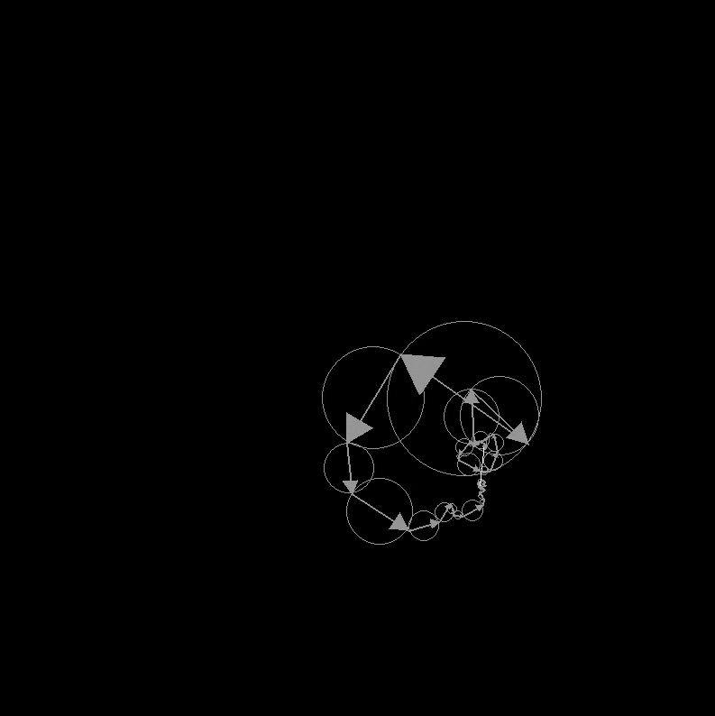

# Fourier Drawing

> Create epicycle drawings using Fourier series

## How it works

This uses complex fourier series to convert an svg image into a sum of trigonometric terms

By far the best explanation of how this work is [this video](https://www.youtube.com/watch?v=r6sGWTCMz2k) by 3blue1brown.